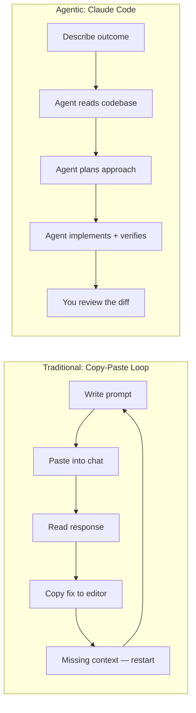
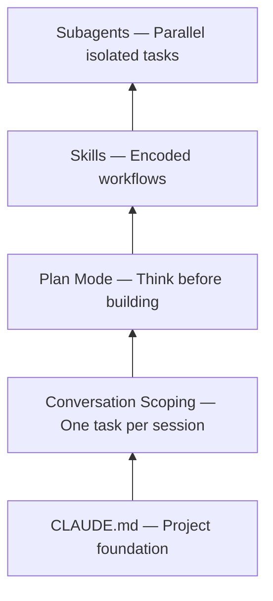
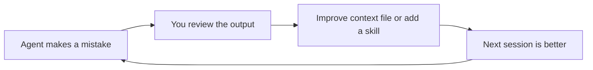

---

title: "Context Engineering: The Skill That Makes AI Coding Tools Actually Work"
date: "2026-02-05"
slug: "context-engineering-ai-coding-tools"
tags: ["Software Engineering", "AI Coding Assistant", "AI Tools", "Developer Productivity", "Agentic Development", "Context Engineering"]
excerpt: "Most developers blame the model when AI coding tools produce bad output. The real problem is context. Here's the system I built to fix that."
seo_title: "Context Engineering: Make AI Coding Tools Actually Work"
meta_description: "Learn how context engineering, agentic workflows, and repeatable skills systems transform AI coding tools from novelty into compounding productivity. Practical patterns from daily use with Claude Code, Cursor, Codex, and more."
target_keywords: "context engineering, agentic coding, AI coding assistant, AI pair programming, Claude Code, Cursor agent mode, Codex CLI, vibe coding, CLAUDE.md, developer productivity, AI code review, agentic development"

---
# Context Engineering: The Skill That Makes AI Coding Tools Actually Work

A developer opens Cursor, types a comment describing a function, and waits for autocomplete to fill in the blanks. Another developer copies a stack trace into ChatGPT, reads the response, copies the fix, pastes it into their editor, realizes the fix references a file ChatGPT never saw, and starts the cycle again. A third asks Copilot to refactor a module. It changes 3 files correctly and breaks 2 others because it couldn't see the import graph.

I've been all three of those developers. The pattern is always the same: we have AI tools that can reason about code, but we keep using them through interfaces that strip away the context they need. We feed them fragments and expect systems in return.

Claude Code changed that for me. It's not a sidebar. It's not autocomplete. It's an agent running in your terminal with direct access to your file system, your shell, and your full project. That single difference rewired how I work with AI.

## Why This Matters Now

Developer tooling crossed a threshold in 2025. The shift went from "AI suggests code" to "AI executes tasks."

Autocomplete and chat assistants are still useful. But they represent a ceiling. They can't read your test suite, run your build, search across 200 files, and propose a fix that accounts for all of them.

Agentic tools can. Claude Code, Cursor's agent mode, Windsurf, OpenAI's Codex CLI, Aider, and a growing list of others now operate *inside* your environment. They read files, write files, run commands, and iterate on results. The model becomes a collaborator with tool access, not a text generator behind a chat window.

The field is crowded. That's a good sign. Copilot added agent mode to VS Code. Cursor and Windsurf offer agentic capabilities inside the editor. Cline and Roo Code bring agent behavior to VS Code as extensions. Codex CLI and Aider take the terminal-native approach. JetBrains ships its own AI assistant. Amazon has Q Developer. The tooling matters less than the workflow patterns you build around it, but choosing a primary tool still matters. I'll explain why I landed on Claude Code after spending real time with several of these.

Some people call this shift "vibe coding." I think the term undersells it. What separates developers getting results from those getting frustrated isn't vibes. It's *context engineering*: deliberately shaping what the agent knows before it starts working.

That's the skill this article is about. Not any one tool. The system behind the tools.

## What Claude Code Is (and Isn't)

Claude Code is a CLI tool from Anthropic. Install it globally with npm, run `claude` in any project directory, and start an interactive session. From there, Claude can read your files, edit them, run shell commands, search your codebase, and access external services through MCP connectors.

The difference from IDE-based assistants: Claude Code operates in your actual environment. It doesn't work from a snapshot or a partial view. It navigates your project the way you would. Runs `grep` to find usages. Reads test files to understand expected behavior. Executes your test suite to verify its own changes.

You stop being the typist and start being the architect.

The workflow difference looks like this:



One loop is friction. The other is delegation.

Here's how the current tools break down:

| Approach | Tools | Tradeoff |
|---|---|---|
| **Autocomplete / inline** | GitHub Copilot (inline), JetBrains AI, Amazon Q Developer | Low friction, limited context. Great for single-line completions, weak on multi-file reasoning. |
| **IDE-integrated agent** | Cursor, Windsurf, Cline, Roo Code, Copilot agent mode | Full IDE access with visual diff review. Tied to a specific editor. Context depends on what the IDE exposes. |
| **Terminal-native agent** | Claude Code, Codex CLI, Aider | Full environment access: file system, shell, git, test runners. Editor-agnostic. Steeper initial learning curve. |

Every tool on this table has real strengths. Cursor's inline diff review is excellent. Aider's git integration is tight. Copilot's autocomplete is still the fastest path for boilerplate. I use Claude Code as my primary because the terminal-native model gives it the deepest environment access, and the context engineering system (CLAUDE.md, skills, subagents) compounds over time in a way the IDE-integrated tools haven't matched yet.

Your mileage will depend on how you work.

But here's the thing about all of these tools: none of them are magic. They're only as good as the context you give them. Which brings us to the skill that actually matters.

## Context Engineering: The Foundation

Most developers try an agentic tool, get mediocre results, and blame the model.

Wrong target. The problem is almost always context.

Context engineering is the practice of shaping what an AI agent knows when it starts working. Every serious tool has a version of this. Claude Code uses `CLAUDE.md`. Cursor uses `.cursorrules`. Codex CLI uses `AGENTS.md`. Aider uses conventions files. The filename differs. The principle is identical: tell the agent how your project works before it starts working.

I think of it as a stack, five layers that build on each other. I call it **The Context Engineering Stack**. The foundation is that context file. I'll use `CLAUDE.md` as the example because it's what I use daily, but everything here applies regardless of tool.

**Your context file is your project's instruction manual for AI.** It sits in your project root and loads automatically every session. A good one covers your project's conventions, file structure, testing patterns, and the specific things that are weird about your codebase. The stuff you'd explain to a new teammate on day one.

A bad context file reads like documentation written for a new hire. A good one reads like notes you'd leave yourself if you knew you'd have amnesia tomorrow.

What to include:

- Project structure (what lives where and why)
- Build and test commands
- Naming conventions specific to your codebase
- Things the agent should never do (don't modify generated files, don't use ORM X)
- The WHY behind constraints, not just the rules

Here's a stripped-down example from a real project:

```markdown
# Project: invoice-api

## Structure
- `src/` — Express API (TypeScript)
- `src/routes/` — One file per resource
- `src/services/` — Business logic layer
- `src/db/` — Prisma schema and migrations
- `tests/` — Jest, mirrors src/ structure

## Commands
- `npm test` — Full suite
- `npm run migrate` — Prisma migrations
- `npm run lint` — ESLint + Prettier

## Conventions
- Routes return typed envelopes: `{ data, error, meta }`
- Services throw AppError, routes catch and format
- Never import from `src/db/` in routes — go through services

## Do NOT
- Modify `src/db/generated/` (Prisma auto-generated)
- Use `any` type — use `unknown` and narrow
- Skip tests. Run `npm test` before marking done.

## Why
- The envelope pattern exists because the mobile team
  parses responses with a shared client. Breaking the
  shape breaks two apps silently.
- The db/ import rule prevents circular deps that
  crashed prod in January. Don't test fate.
```

Notice the "Why" section. Most context files I see list rules without reasons. When the agent understands *why* a constraint exists, it generalizes. It won't just avoid importing from `src/db/` in routes. It'll recognize the same pattern in a new module you haven't written rules for yet.

That's the difference between a rule and a principle. Rules need to be enumerated. Principles scale.

Beyond the context file, you need to manage your conversation scope. Here's something most people miss: context quality degrades at 20-40% of the window, not at 100%. You don't wait for the model to forget things. You proactively scope one conversation per feature or task.

When context gets bloated, I use **The Copy-Paste Reset**: copy the important context (current plan, key decisions, file paths), run `/clear`, and paste back only what matters. Fresh window. Critical information preserved.

The governing principle: **bad output = bad input.** If the agent produces garbage, your context failed. Fix the input before blaming the output.

The full stack:



Each layer builds on the one below it. You get real value from the context file alone. You don't need subagents on day one. But as you move up the stack, the returns compound.

That foundation is only half the equation, though. You also need a way to make the agent *think* before it builds.

## Plan Mode: Five Minutes That Save Five Hours

Most developers jump straight to "build this feature" and let AI start coding immediately.

This is the equivalent of writing code without reading the requirements. It works for trivial tasks. It falls apart for anything with more than one moving part.

Plan mode (Shift+Tab twice in Claude Code) tells the agent to research and think before acting. It reads relevant files, maps dependencies, identifies edge cases, and presents an implementation plan. You review the plan, adjust it, and only then let it execute. Cursor and Windsurf have similar planning workflows. The shortcuts differ. The pattern transfers everywhere: force the agent to research before coding.

I've tested this across refactoring, feature work, bug fixes, and infrastructure changes. Plan mode consistently produces better output than jumping straight to implementation. 5 minutes reviewing a plan eliminates the 2 hours debugging a half-baked implementation.

A workflow that compounds this: use your most capable model for planning and a faster one for execution. In Claude Code, that means Opus for planning and Sonnet for implementation (switch with Shift+Tab). The stronger model handles architectural reasoning. The faster one handles straightforward implementation at lower cost. Your context file ensures both operate under the same project constraints.

Here's what this looks like in practice. Last week I needed to add Google OAuth to an Express API. Instead of jumping in, I opened plan mode:

> Add Google OAuth2 login to the /auth routes. Use Passport.js. Existing session middleware is in src/middleware/session.ts. Users table already has a google_id column.

Claude spent about 90 seconds reading files. Came back with a 6-step plan: install dependencies, create a strategy file, add callback routes, wire into the middleware chain, update `.env.example`, add a deserialize query using the existing `UserService`. Standard stuff.

Then the last line:

> **Risk identified:** The session middleware uses express-session with MemoryStore. Passport sessions will work in development but fail in production with multiple instances. Recommend flagging for Redis migration.

That's the kind of thing I'd catch during code review, not during implementation. Plan mode caught it before a single line was written. I approved the plan. Ten minutes later: six files updated, tests passing, OAuth flow working.

I spent my time reviewing diffs instead of writing boilerplate.

Plan mode gives you the architecture check. But what about the tasks you repeat every week?

## Skills and Subagents: Teaching the Agent Your Workflow

The best agentic workflows encode repeatable patterns so the agent doesn't start from scratch every session. The implementation differs by tool (Cursor's custom rules, Copilot's instruction files, Codex's agent configuration all serve similar purposes) but the idea is the same: teach the agent once, reuse forever.

In Claude Code, these are called **Skills**. They're markdown files with a name, a description, and detailed instructions. Claude loads them using progressive disclosure: only the name and description (~100 tokens each) are pre-loaded. Full instructions load only when the skill is relevant. You can have dozens without bloating your context window.

A skill might encode your team's commit message format, your PR review checklist, your deployment process. Things you'd otherwise explain every single session.

Here's what a PR review skill looks like:

```markdown
---
name: pr-review
description: Review PRs using team conventions and security checklist
---

When asked to review a PR:

1. Run `git diff main...HEAD` to see all changes
2. Check each file against these criteria:
   - **Security:** No hardcoded secrets, no SQL injection,
     input validation at API boundaries
   - **Conventions:** Follows existing patterns in the codebase
   - **Tests:** New logic has corresponding test coverage
   - **Types:** No `any` types, proper error handling
3. Format the review as:
   ## Summary
   One paragraph on what this PR does.
   ## Issues
   - [Must fix] file:line — Description
   - [Should fix] file:line — Description
   - [Suggestion] file:line — Description
   ## Verdict
   APPROVE / REQUEST_CHANGES with reason
4. Be specific. Reference file names and line numbers.
5. Don't nitpick formatting — the linter handles that.
```

~30 lines of markdown. It loads only when you ask Claude to review a PR. The rest of the time, Claude sees just the name and description. 15 tokens of overhead.

**Subagents** are the second piece. They handle isolated subtasks in fresh context. You're deep in a feature implementation and need security analysis on a specific file? Claude delegates to a subagent. It gets its own context window, does the work, returns a summary. Your main context stays clean.

The built-in subagents cover common patterns: Explore for read-only codebase analysis, Plan for research, general-purpose for multi-step tasks. You can build custom ones too. A code review pipeline might run style checking, security scanning, and test coverage analysis in parallel across separate subagents.

Here's the compound effect: skills encode how you work. Subagents handle the grunt work. MCP connectors let the agent access GitHub, Slack, and databases without leaving your terminal. Every skill you add, every connector you wire up stays available for every future task.

The system gets better every session. That's not a feature of the tool. It's a feature of the investment.

But skills and subagents are still interactive. What if you want the agent to work without you?

## Building Systems, Not Just Using Tools

The `-p` flag runs Claude Code in headless mode. No interactive interface. Pipe in a prompt, get output. This is where the tool stops being a development assistant and starts being infrastructure.

Here's a security review script that runs in CI on every pull request:

```bash
#!/bin/bash
# ai-security-review.sh — Triggered by CI on pull requests

DIFF=$(git diff origin/main...HEAD)

claude -p "Review this diff for security vulnerabilities.
Check for: SQL injection, XSS, hardcoded secrets,
insecure deserialization, missing input validation.

Output JSON: [{severity, file, line, description}]
Return empty array if clean.

$DIFF" \
  --output-format json \
  --max-turns 3
```

Same pattern works for release notes, deprecation audits, documentation updates. The `-p` flag turns any workflow into a scriptable pipeline step.

**The Improvement Flywheel** ties it all together:



Every correction makes the system smarter. Every session builds on the last.

The engineers getting the most from these tools aren't treating them as a one-off productivity boost. They're investing in a system the same way they'd invest in CI/CD or monitoring. The returns compound.

But only if you're honest about where the tool breaks down.

## Where It Falls Short

No honest assessment skips this part.

**Cost adds up fast.** A heavy Opus planning session can run $2-5 in API credits. A full day of agentic development might cost $20-40. For solo developers and side projects, that's real money. The model tiering strategy (Haiku for simple tasks, Sonnet for implementation, Opus for architecture) isn't a nice-to-have. It's survival. I burned through $15 on a Saturday experimenting with Opus on tasks Sonnet could've handled. Don't repeat my mistake.

**Latency kills small tasks.** 5-15 seconds to respond to a simple request. Need to rename a variable or fix a typo? Your editor's find-and-replace is faster. Agentic tools shine on multi-file, multi-step work. For single-line fixes, they add overhead.

**The learning curve hits up front.** Your first week will feel slower, not faster. You're writing context files, learning plan mode, figuring out conversation scoping. The returns are real, but they take 2-3 weeks of consistent use to show up. Most developers who abandon ship after two days never reach the inflection point.

**It doesn't replace understanding.** The agent can implement a feature you've designed. It can't design a system you don't understand. If you can't review the output critically, you'll ship bugs with more confidence, which is worse than shipping bugs with doubt.

**Context windows have hard limits.** Even with conversation scoping and The Copy-Paste Reset, complex tasks hit the ceiling. A massive refactor across 50+ files requires breaking work into phases. The agent won't tell you when it's lost context. The output just gets subtly worse. You develop the instinct for when to stop and reset, or you ship garbage.

These are real tradeoffs. But the biggest gap in the agentic coding conversation isn't about the tools. It's about the skill nobody teaches.

## Reviewing AI-Generated Code: The Skill Nobody Teaches

Everyone talks about how to *prompt* AI coding tools. Almost nobody talks about how to *review* what they produce.

This is the hardest part. And the most important.

When you review AI-generated diffs, here's what to watch for:

**Hallucinated imports.** The agent references a module or type that doesn't exist in your codebase. It looks plausible. It fails at build time. I catch these about once a week.

**Confident logic errors.** The code reads correctly. It passes basic tests. But it handles an edge case wrong: off-by-one, incorrect null handling, swapped conditionals. AI-generated code tends to be *confidently wrong* rather than obviously broken. That's what makes it dangerous.

**Unnecessary abstraction.** The agent adds helper functions, configuration options, or patterns you didn't ask for. More code means more surface area for bugs. You asked for a feature. You should get the feature, not a framework.

**Silent behavior changes.** The agent modifies a function signature, changes a default value, or reorders operations in a way that affects callers it didn't examine. This is the scariest category because the diff looks clean.

**Stale context artifacts.** The agent references decisions from earlier in the conversation that you've since revised. This is your signal: context window is degrading. Time for The Copy-Paste Reset.

Here's the instinct to develop: if a diff *looks* right but you can't explain *why* it's right, that's a red flag. Slow down. Read line by line. The speed benefit of agentic coding comes from delegation, not from skipping review.

## The Playbook

**Do:**

- Write a context file before your first session. `CLAUDE.md`, `.cursorrules`, `AGENTS.md`, whatever your tool uses. Update it constantly. In Claude Code, press `#` to add instructions on the fly.
- Scope one conversation per task. Don't bleed contexts across features.
- Use plan mode for anything non-trivial. Review the plan before execution. Every major agentic tool has some version of this.
- Start with the smallest model that works. Cheap and fast for implementation, capable and expensive for architecture.
- Show examples instead of explaining. A minimal code sample beats 3 paragraphs of description.
- Encode one repeatable workflow this week. A skill, a custom rule, a conventions file. Pick whatever you find yourself explaining every session.

**Don't:**

- Keep working after context feels degraded. Clear and restart. Always.
- Let the agent loop. If you've explained the same thing 3 times and it's not getting it, the approach is wrong. Change the angle, simplify the task, or show an example.
- Dump your entire codebase as context. Scope what the agent sees to what's relevant.
- Skip human review on anything that ships. AI is an assistant, not an authority.
- Run automated AI pipelines on production without guardrails. Hooks, approval gates, and sandboxing exist for a reason.
- Ignore cost. Premium models can cost 10-15x more per token. Route tasks to the right tier.

## Start Here

Pick one thing.

Write a context file for your current project. `CLAUDE.md`, `.cursorrules`, `AGENTS.md`, whatever your tool uses. 30 minutes. Document your project's conventions, structure, and constraints. That single file will improve every AI interaction you have in that codebase. If you haven't picked a tool yet, Claude Code (`npm install -g @anthropic-ai/claude-code`) is where I'd start. But the file matters more than the tool.

If you're already using an agentic tool, try plan mode on your next feature. Force the agent to research before building. Review the plan. Adjust it. Then let it execute. Count the back-and-forth corrections compared to your normal workflow.

The developers building real productivity advantages with AI aren't using better models. They're building better systems around the models they have.

The tool is your choice. Context engineering is the skill. 30 minutes to set up. Compounds from day one.
